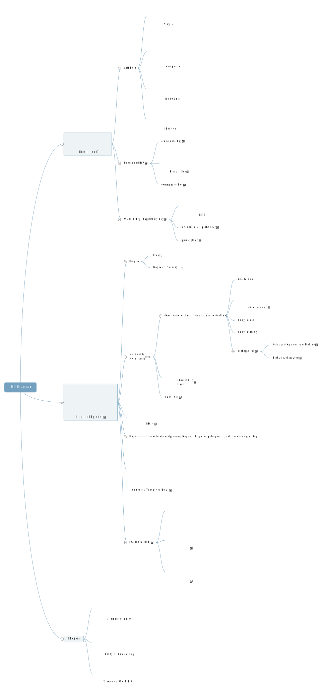

# Database System Outline

## DBMS Overview

###Terminology
**Database Management System (DBMS)** is a software package that manages databases.

**Database** = interrelated data  + database applications

**Some database**

Oracle’s Oracle

IBM’s DB2

Microsoft’s Access, SQL Server

MySQL, PostgreSQL, MangoDB, …

###Data Independence: the separation of applications from data
####Solution: levels of abstraction

**Physical Level**: how record is stored on disks, file formats? Locations?

**Logical Level**: how data are structured in db, relationships among the data

**View Level**: Define a subset of database, hide some unrelative data, add some information derived from original record. Application access the database through view level. 

Each level is defined by a **schema**

**Database instance**: actual content of the db at a particular point in time

####Data Independence:  change in one level would not affect nearby level

Physical Data independence: Physical || Logical

Logical Data independence: Logical || View

## Entity Relationship (ER) Model

## Relational Model, Algebra
## SQL
## Functional Dependencies and Relational Database Design
## Storage and File Systems
## Tree and Hash Indexes
## Query Processing
## Query Optimization
## Physical Database Design
## Transactions
## Concurrency Control Protocols
## Database Recovery 

